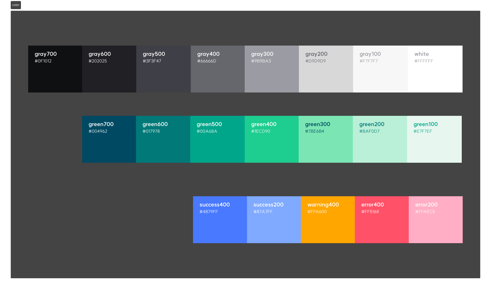
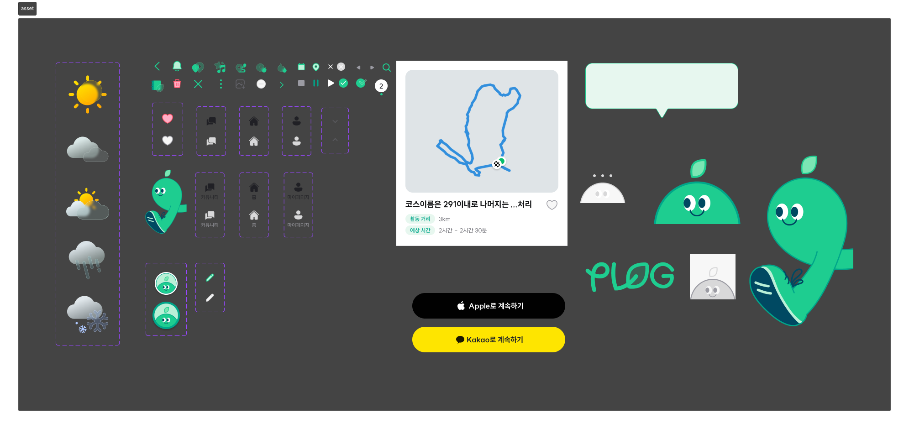
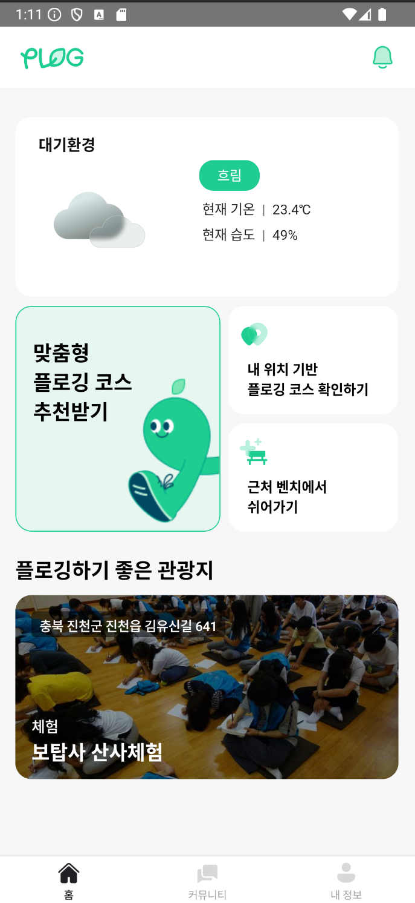
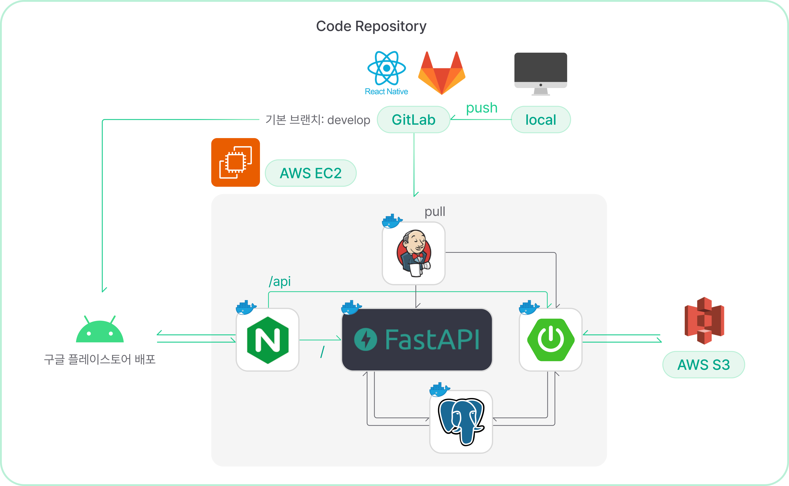

# README

# 환경 문제를 건강하게 해결하는 서비스, "Plog"

## 프로젝트 소개

PLOG는 나만의 맞춤형 플로깅 장소를 추천받고, 이를 효과적으로 기록하는 서비스입니다.

### 배경

- 국민환경의식조사 결과에 따르면 우리나라가 직면한 가장 중요한 환경 문제는 쓰레기/폐기물 처리 문제로 65.7%에 해당하는 응답률을 기록하였습니다.
- 또한 생활계 플라스틱 폐기물 발생량 예측이 지속적으로 증가하고 있으며, 1인당 연간 일회용 플라스틱 소비량이 증가하고 있습니다.
- 플로깅을 통한 환경 보호 노력 및 성과를 공유하고, 묶어낼 수 있는 플랫폼을 위해 서비스를 준비하게 되었습니다.

### 서비스 목적

서울시 관광지와 CCTV 공공데이터를 활용해:

- 안전한 이동 경로를 제공
- 주위 환경을 실시간으로 모니터링하여 안전성을 높임

이 서비스를 통해 서울 시민과 관광객들이 보다 안심하고 야간에도 자유롭게 이동할 수 있는 환경을 조성하고자 합니다.

## 디자인 시스템

## 화면 구성 📺

### 온보딩 스크린 & 홈 스크린

### 마이페이지

### 맞춤형 코스 추천, 플로깅

### 내 주변 벤치 찾기

### 커뮤니티 페이지

# PLOG-server

---

## IDE

- Intellij IDEA 2024.1.1 (ver 241.15989.150)

## Framework

- Spring Boot 3.2.5
- FastApi 0.103

### Library

- Java(TM) SE Development Kit 17.0.10 (64-bit)
- Lombok

## DB

- Postgresql

## **Architecture**

---

## ERD

---

# API 명세서

---

## SPRING

## FastApi

# Convention

---

## issue label

| tag name | purpose |
| --- | --- |
| Feat | 새로운 기능 추가 |
| Fix | 버그 수정 |

## branch convention

| tag name | purpose |
| --- | --- |
| develop | 개발 브렌치 |
| feature | 기능 개발 브렌치 ex) feature/issue번호-기능요약 |
| fix | 버그 수정 브렌치 ex) fix/issue번호-버그요약 |
| release | 배포 브렌치 ex) release/v1.0 |

## commit convention

| tag name | purpose |
| --- | --- |
| Feat | 새로운 기능 추가 |
| Fix | 버그 수정 |
| Env | 개발 환경 관련 설정 |
| Style | 코드 스타일 수정(세미콜론, 인텐트 등의 스타일적인 부분만) |
| Commnet | 주석 추가/수정 |
| Docs | 내부 문서 추가/수정 |
| Test | 테스트 추가/수정 |
| Chore | 빌드 관련 코드 수정 |
| Rename | 파일 및 폴더명 수정 |
| Remove | 파일 삭제 |
| Init | 프로젝트 등록(1회성) |

